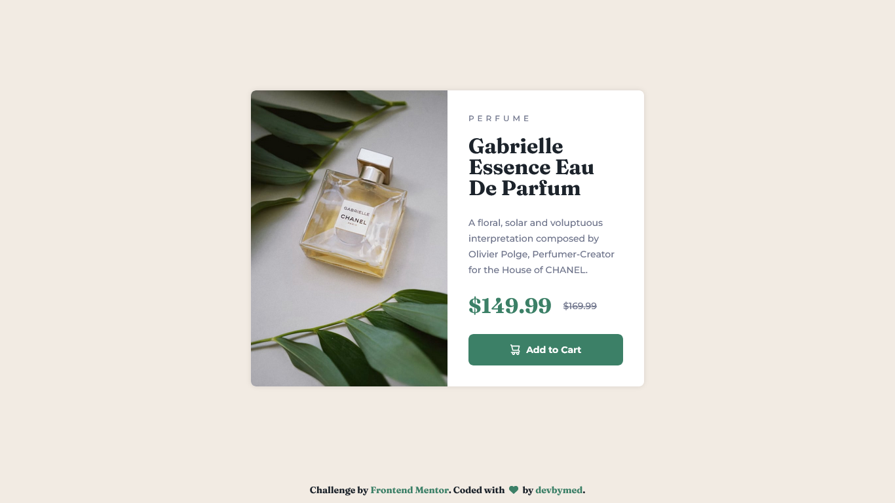

# Product preview card component solution

This is a solution to the [Product preview card component challenge on Frontend Mentor](https://www.frontendmentor.io/challenges/product-preview-card-component-GO7UmttRfa). 🙌

Frontend Mentor challenges help you improve your coding skills by building realistic projects. 🚀

## 📌 Table of contents

- [Overview](#overview)
  - [The challenge](#the-challenge)
  - [Screenshot](#screenshot)
  - [Links](#links)
- [My process](#my-process)
  - [Built with](#built-with)
  - [Useful resources](#useful-resources)
- [Author](#author)

## ✔ Overview

### ➥ The challenge

Users should be able to:

- View the optimal layout depending on their device's screen size
- See hover and focus states for interactive elements

### ➥ Screenshot (Desktop)

### ➥ Links

- Solution URL: 
- Live Site URL: 

## ✔ My process

### ➥ Built with

- Semantic HTML5 markup
- BEM naming convention
- CSS custom properties
- Mobile-first workflow
- CSS Grid
- Flexbox

### ➥ Useful resources

- [BEM — Naming](https://getbem.com/naming/) - This explains the BEM naming convention in details.
- [Josh Comeau's Custom CSS Reset](https://www.joshwcomeau.com/css/custom-css-reset/) - Josh Comeau's CSS reset is a great way to reset the default browser styles. You can use it as a starting point for your own reset.

## ✔ Author

- Frontend Mentor - [@devbymed](https://www.frontendmentor.io/profile/devbymed)
